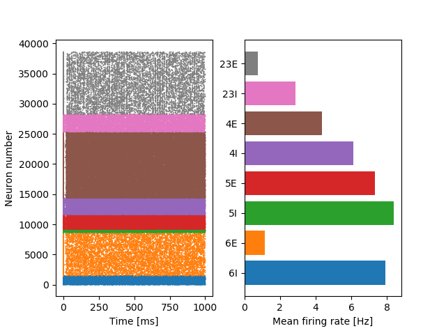

# Larger GPU-accelerated brain simulations with procedural connectivity
Large-scale simulations of spiking neural network models are an important tool for improving our understanding of the dynamics and ultimately the function of brains.
However, even small mammals such as mice have on the order of 1 trillion synaptic connections which, in simulations, are each typically charaterized by at least one floating-point value.
This amounts to several terabytes of data - an unrealistic memory requirement for a single desktop machine.
Large models are therefore typically simulated on distributed supercomputers which is costly and limits large-scale modelling to a few privileged research groups.
In this work, we describe extensions to GeNN - our Graphical Processing Unit (GPU) accelerated spiking neural network simulator - that enable it to 'procedurally' generate connectivity and synaptic weights 'on the go' as spikes are triggered, instead of storing and retrieving them from memory.
We find that GPUs are well-suited to this approach because of their raw computational power which, due to memory bandwidth limitations, is often under-utilised when simulating spiking neural networks.
We demonstrate the value of our approach with a recent model of the Macaque visual cortex consisting of 4.13 million neurons and 24.2 billion synapses.
Using our new method, it can be simulated on a single GPU - a significant step forward in making large-scale brain modelling accessible to many more researchers.
Our results match those obtained on a supercomputer and the simulation runs up to 35% faster on a single high-end GPU than previously on over 1000 supercomputer nodes.

## System requirements
Although GeNN can be used without a GPU, because this paper focusses on GPU acceleration, an NVIDIA GPU with the Kepler architecture or newer is required.
Furthermore, to simulate the multi-area model, a GPU with at least 12GB of memory is required (depending on the device and operating system, you may need more memory than this) - it has been tested on an Tesla K80 and a Titan RTX.

### Windows
To build GeNN, Visual Studio 2015 or later and Python 3.5 or later is required.
The version of GeNN included in this repository has been tested with:
* Windows 10 with Visual Studio 2019, CUDA 10.1 and Python 3.7.7 provided by Anaconda
* Windows 10 with Visual Studio 2017, CUDA 10.1 and Python 3.7.0 provided by Anaconda

### Linux
To build GeNN, GCC 4.9.1 or later and Python 2.7 or later is required.
The version of GeNN included in this repository has been tested with:
* Ubuntu 18.04; GCC 7.5.0; CUDA 10.0; 10.1 and 10.2; and Python 3.6.9
* Arch Linux, GCC 10.1, CUDA 10.2 and Python 3.8.3

## Installation guide
Installation should take less than 5 minutes on a standard PC.
We recommend using [python virtualenvs](https://pypi.org/project/virtualenv/) to prevent conflicts between installed python package versions.

### Windows
These instructions assume that the Anaconda platform was used to install Python, but it _should_ be possible to install PyGeNN using suitable versions of Python installed in a different way.
On Windows, installation requires a command prompt with the environment correctly configured for both Visual Studio **and** Anaconda. 
To create one, launch an "x64 Native Tools Command Prompt" from your chosen version of Visual Studio's start menu folder and _activate_ your chosen version of Anaconda by running the ``activate.bat`` in its ``Scripts`` directory. 
For example, if your user is called "me" and Anaconda is installed in your home directory, you might run ``c:\Users\Me\Anaconda3\Scripts\activate.bat c:\Users\Me\Anaconda3``.

1. Clone this repository using ``git clone --recursive https://github.com/BrainsOnBoard/procedural_paper.git``
2. Ensure that swig is installed. For example, if you are using Anaconda, run ``conda install swig``.
3. Ensure that numpy is installed. For example by running ``pip install numpy``.
4. Ensure that the version of GeNN included in this repository is in the path. For example, if your user is called "me" and this repository is located in Documents, you could run the following in the terminal ``SET "PATH=%PATH%;c:\Users\me\Documents\procedural_paper\genn\bin"``.
5. From the ``genn`` directory of this repository, build GeNN libraries with ``msbuild genn.sln /t:Build /p:Configuration=Release_DLL``
6. From the ``genn`` directory of this repository, copy the GeNN libraries into the correct location with ``copy /Y lib\genn*Release_DLL.* pygenn\genn_wrapper``
7. From the ``genn`` directory of this repository, build python extension using ``python setup.py develop``

### Linux
1. Clone this repository using ``git clone --recursive https://github.com/BrainsOnBoard/procedural_paper.git``
2. Ensure that swig is installed. For example, on an Ubuntu system, run ``sudo apt-get install swig``.
3. Ensure that numpy is installed. For example by running ``pip install numpy``.
4. Ensure the ``CUDA_PATH`` environment variable is set to point to your CUDA installation. For example from a bash terminal you could run ``export CUDA_PATH=/usr/local/cuda``.
5. Ensure that the version of GeNN included in this repository is in the path. For example, from the ``genn`` directory of this repository, you could run the following in a bash terminal ``PATH=%PATH%:`pwd`/bin``.
6. From the ``genn`` directory of this repository, build GeNN libraries with ``make DYNAMIC=1 LIBRARY_DIRECTORY=`pwd`/pygenn/genn_wrapper/``
7. From the ``genn`` directory of this repository, build python extension using ``python setup.py develop``

## Demo
To demonstrate your newly installed version of GeNN, you can run the GeNN implementation of [The Cell-Type Specific Cortical Microcircuit](http://www.ncbi.nlm.nih.gov/pubmed/23203991) developed by Tobias C. Potjans and Markus Diesmann, previously discussed in [our paper](https://www.frontiersin.org/articles/10.3389/fnins.2018.00941).
This should take less than 2 minutes on a standard PC.

### Windows
1. Navigate to the ``genn/userproject/PotjansMicrocircuit_project`` directory of this repository.
2. Build the project runner executable with ``msbuild ..\userprojects.sln /t:generate_potjans_microcircuit_runner /p:Configuration=Release``
3. Build and simulate the project with ``generate_run test`` where "test" is the name of the folder to save the model output.
4. Plot results with ``python plot.py test`` where "test" is again the name of the folder to save the model output.

### Linux
1. Navigate to the ``genn/userproject/PotjansMicrocircuit_project`` directory of this repository.
2. Build the project runner executable with ``make``
3. Build and simulate the project with ``./generate_run test`` where "test" is the name of the folder to save the model output.
4. Plot results with ``python plot.py test`` where "test" is again the name of the folder to save the model output.

A raster plot resembling this one should then be displayed:

## Instructions for use
If you are interested in using GeNN for simulating your own models please see the [user manual](https://genn-team.github.io/genn/documentation/4/html/index.html) or the [tutorial](https://github.com/neworderofjamie/new_genn_tutorials).
To reproduce the figures included in this paper, please follow the steps below.

### Reproducing figure 1
Instructions for simulating model are included in a seperate [readme](models/va_benchmark/README.md)
Data points can be added to [scaling_data.csv](scripts/scaling_data.csv) and then plotted using [plot_performance_scaling.py](scripts/plot_performance_scaling.py).

### Reproducing figure 2
Instructions for simulating model are included in a seperate [readme](models/neuron_merge/README.md)
Data points can be added to [merging_data.csv](scripts/merging_data.csv) and then plotted using [plot_merging_scaling.py](scripts/plot_merging_scaling.py).

### Reproducing figure 3
Install additional python dependencies using ``pip install -r models/multi-area-model/requirements.txt``
The "ground state" simulation can be run using the [run_example_fullscale.py](https://github.com/neworderofjamie/multi-area-model/blob/master/run_example_fullscale.py) and the "resting state" simulation using [run_example_1_9_fullscale.py](https://github.com/neworderofjamie/multi-area-model/blob/master/run_example_1_9_fullscale.py).
Spike trains from the simulations will be saved into the [simulations](https://github.com/neworderofjamie/multi-area-model/blob/master/simulations) directory and can be processed to produce the spiking statistics included in figure 3 using the [calc_multi_area_stats.py](scripts/calc_multi_area_stats.py) script and then plotted using the [calc_multi_area_stats.py](scripts/plot_multi_area.py) script.
